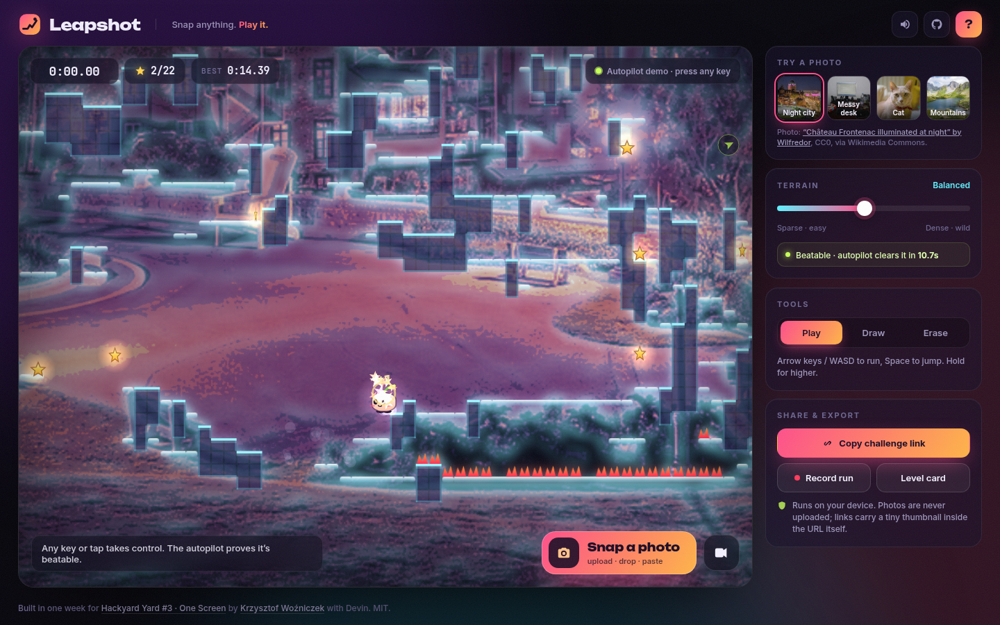
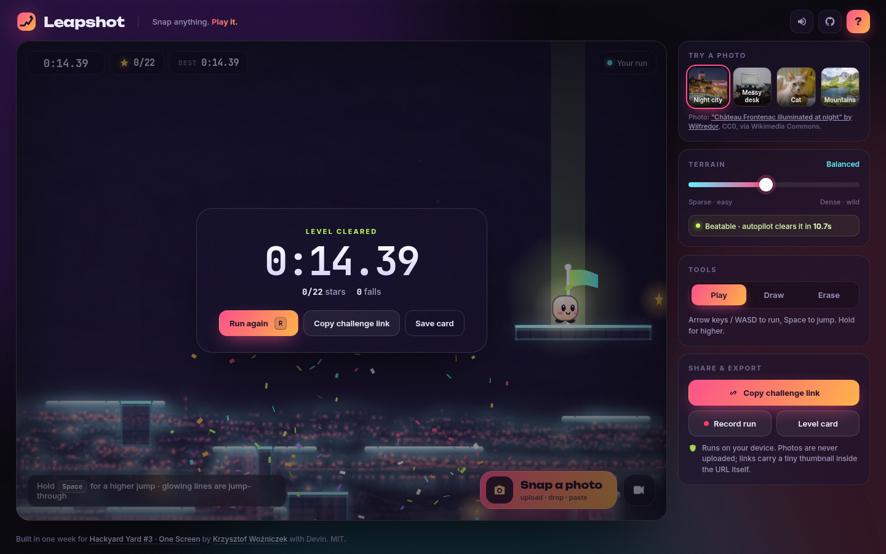
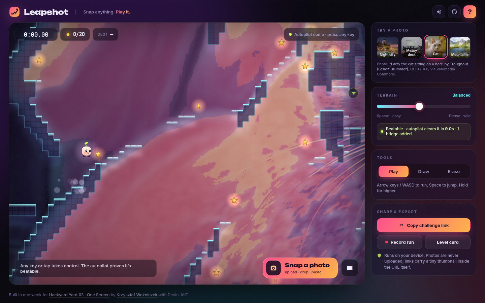

# Leapshot

**Snap anything. Play it.** Leapshot turns any photo into a playable platformer level, right in your browser. The photo stays visible as the level art, so you literally run across your desk, your cat or your city skyline.

**[Play the live demo →](https://chris-wozniczek.github.io/leapshot/)** · [Watch the 36s demo video](https://chris-wozniczek.github.io/leapshot/assets/demo.mp4)



## How to use

1. **Open the page.** A level built from a sample photo is already running on autopilot. Press any key (or tap) to take control.
2. **Run and jump.** `←` `→` / `A` `D` to run, `Space` / `↑` / `W` to jump (hold for a higher jump). `R` restarts, `M` mutes, `?` opens help.
3. **Make your own.** Click **Snap a photo** to upload, drag-and-drop an image anywhere, paste one with `Ctrl/Cmd+V`, or use the webcam button.
4. **Tweak it.** The **Terrain** slider regenerates the level live (sparse and easy to dense and wild). **Draw / Erase** lets you paint platforms; the solver re-checks every stroke.
5. **Share it.** **Copy challenge link** packs the whole level plus a tiny thumbnail and your best time into the URL hash. No server involved. **Record run** saves a WebM of your next run; **Level card** saves a 1200×630 PNG.

| Beat the clock | Every photo is different |
| --- | --- |
|  |  |

## How it works

- **Vision, no ML.** The photo is cropped to a tile grid (8 px cells, analysed at 4 px/cell). It's converted to luminance, blurred twice with a small Gaussian, and run through a Sobel filter. Cells whose edge energy passes a threshold (set by the Terrain slider) become solid tiles. Thin horizontal runs become jump-through ledges.
- **Cleanup.** Single-cell gaps are closed, isolated specks and tiny islands are removed, and pads are carved for the start (left) and the goal (top-right-ish).
- **Hazards and loot.** Dark, low-detail regions sitting on top of floors grow spikes. Bright highlights turn into stars, biased toward places the player can actually reach.
- **Guaranteed playable.** A BFS runs over standing spots, but instead of approximating jump arcs it runs the *real* game physics for a set of move/jump/hold actions. If the goal isn't reachable, the solver carves bridge corridors from the closest reachable spot toward the goal and searches again. The path it finds is replayed as the autopilot demo you see on load.
- **Game feel.** Fixed-timestep physics at 120 Hz with coyote time, jump buffering, variable jump height and one-tile step-ups. The camera follows with eased look-ahead. Squash and stretch, dust, sparks, screen shake on death and a confetti win. All sound is synthesized live with the Web Audio API; there are no audio files.
- **Art.** The photo is posterized through a custom duotone-ish palette, and the edge map is re-drawn as a soft neon glow under the tiles.
- **Sharing.** The tile grid is packed at 2 bits per cell together with the start, goal, stars, best time and a ~200 px WebP thumbnail, compressed with `CompressionStream('deflate-raw')` and base64url-encoded into the `#hash`. Opening the link rebuilds the level locally.

Generation and solving run in a Web Worker, so the UI stays at 60 fps.

## Tech stack

Plain HTML, CSS and vanilla ES modules. Canvas 2D, Web Workers, Web Audio, CompressionStream, MediaRecorder, getUserMedia. No framework, no build step, no dependencies. Fonts: Unbounded, Inter and JetBrains Mono from Google Fonts. Hosted on GitHub Pages via GitHub Actions.

## Privacy

Everything runs on your device. Photos are never uploaded anywhere: there is no backend. A share link only contains what you put in it (the tile grid and a small thumbnail), and it lives in the URL fragment, which browsers don't send to servers.

## Run locally

```bash
git clone https://github.com/chris-wozniczek/leapshot.git
cd leapshot
python3 -m http.server 8080   # any static server works
# open http://localhost:8080
```

ES modules and workers need to be served over HTTP, so opening `index.html` directly from disk won't work.

## Sample photo credits

All from Wikimedia Commons:

- [“Château Frontenac illuminated at night in Quebec City”](https://commons.wikimedia.org/wiki/File:Chateau_Frontenac_illuminated_at_night_in_Quebec_City.jpg) by Wilfredor, CC0
- [“Messy translator desk with mini neko”](https://commons.wikimedia.org/wiki/File:Messy_translator_desk_with_mini_neko.jpg) by Arria Belli, public domain
- [“Larry the cat sitting on a bed (DSC 0010)”](https://commons.wikimedia.org/wiki/File:Larry_the_cat_sitting_on_a_bed_(DSC_0010).jpg) by Trougnouf (Benoit Brummer), [CC BY 4.0](https://creativecommons.org/licenses/by/4.0/)
- [“Zagedan Lakes, Mountain cirque, Caucasus Mountains”](https://commons.wikimedia.org/wiki/File:Zagedan_Lakes,_Mountain_cirque,_Caucasus_Mountains.jpg) by Vyacheslav Argenberg, [CC BY 4.0](https://creativecommons.org/licenses/by/4.0/)

Photos were resized and cropped for the app.

## Built for Hackyard Yard #3: One Screen

Made for [Hackyard Yard #3](https://hackyard.tech/yards/yard-3), theme **One Screen**. Everything happens on a single view: the game, the photo intake, the tools and the instructions. All code was written from scratch during the build week (Sep 21 to Sep 25, 2026).

Built by [Krzysztof Woźniczek](https://github.com/chris-wozniczek) with [Devin](https://devin.ai), the AI software engineer that wrote the code.

## License

[MIT](LICENSE)
